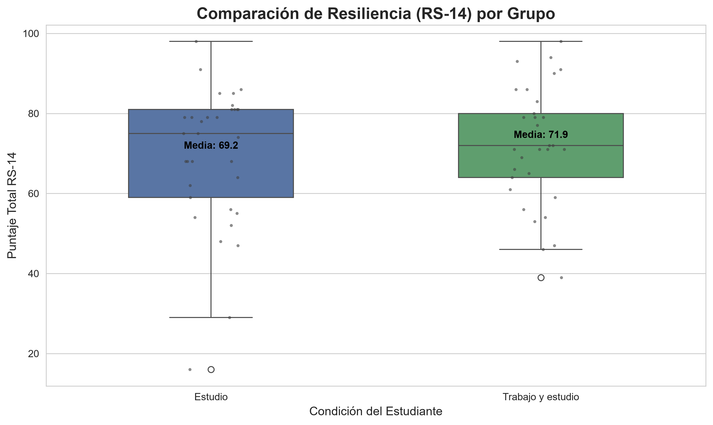

# portafolio_resiliencia
Análisis de resiliencia en estudiantes universitarios (RS-14). Comparación entre quienes solo estudian y quienes combinan estudio con trabajo. Reproducción en Python del análisis descriptivo original realizado en JASP. Medias: 69.18 vs 71.88; U=523.5, p=0.396 → no significativo.

## Visualización de Resultados

*Figura 1: Distribución de puntajes RS-14 por grupo. Los puntos representan participantes individuales.*
